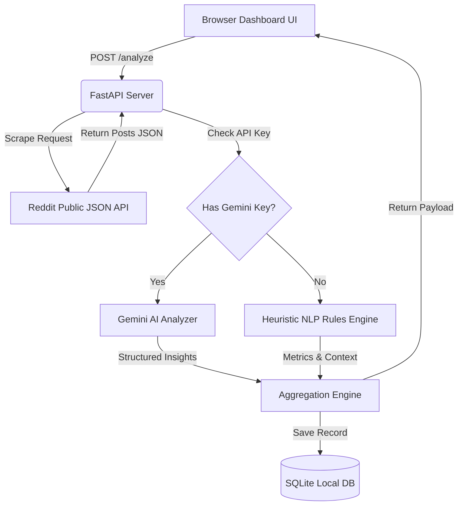

# Reddit Startup Demand Checker

An autonomous market validation tool that scrapes Reddit for keyword mentions of a startup idea, parses engagement data, and runs heuristic and optional AI-based natural language analysis to determine product demand.

## Features
- **Public Scraping Engine**: Fetches search results from specified subreddits (`r/SideProject`, `r/startups`, `r/saas`, `r/entrepreneur`) using Reddit's public `.json` search endpoints, avoiding authentication overhead and API key requirements.
- **Dual Analysis Engine**:
  - **Local Heuristics**: Evaluates post volume, engagement metrics (score, comments), and frustration keyword density using a structured rule-based parser.
  - **Gemini AI Integration**: If a `GEMINI_API_KEY` is provided, performs deep natural language analysis to extract specific pain points, competitor gaps, suggested features, and AI-validated demand scores.
- **Industrial Utilitarian UI Console**: A dark mode dashboard designed with high-contrast amber warning accents, live mechanical system console logs, and score progress indicators.
- **SQLite History**: Saves validation reports locally with options to review, load, or delete past research details.

## Technical Architecture



## System Requirements
- Python 3.8 or higher
- Internet connection (for Reddit scraping and optional Gemini API)

## Installation & Setup

1. **Navigate to the project directory**:
   ```bash
   cd "/Users/nishantbhavsar/Projects/RedditStartupDemandChecker"
   ```

2. **Create a virtual environment**:
   ```bash
   python3 -m venv .venv
   source .venv/bin/activate
   ```

3. **Install dependencies**:
   ```bash
   pip install -r requirements.txt
   ```

4. **Start the server**:
   ```bash
   uvicorn app:app --reload --port 8000
   ```

5. **Open in browser**:
   Navigate to `http://localhost:8000` to access the console interface.

## Running Tests
Run tests to verify backend logic and database integration:
```bash
pytest
```

## GitHub
https://github.com/Nishantbhavsar2009/RedditStartupDemandChecker
